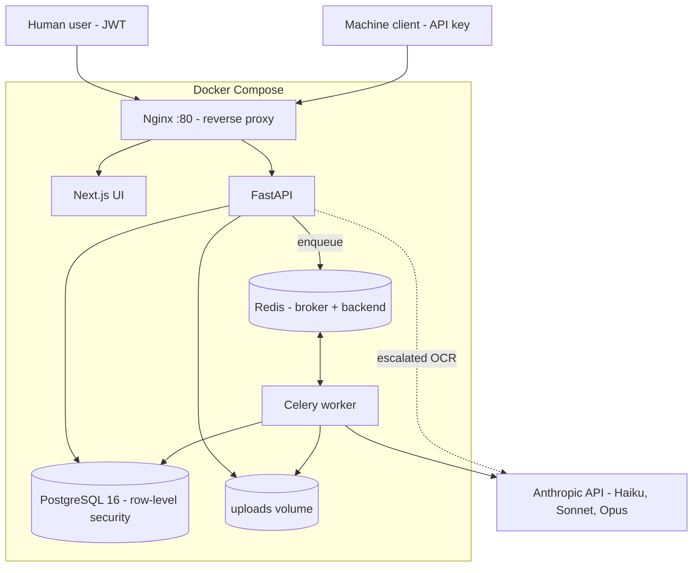
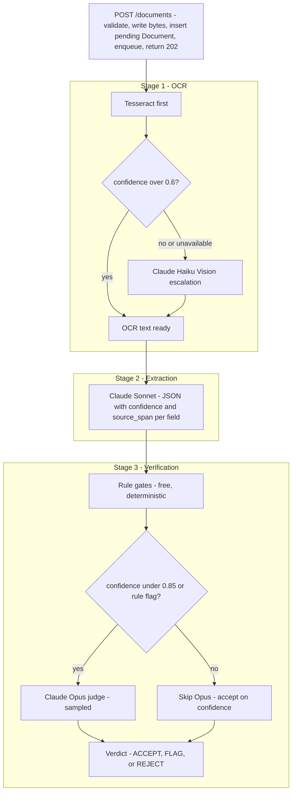
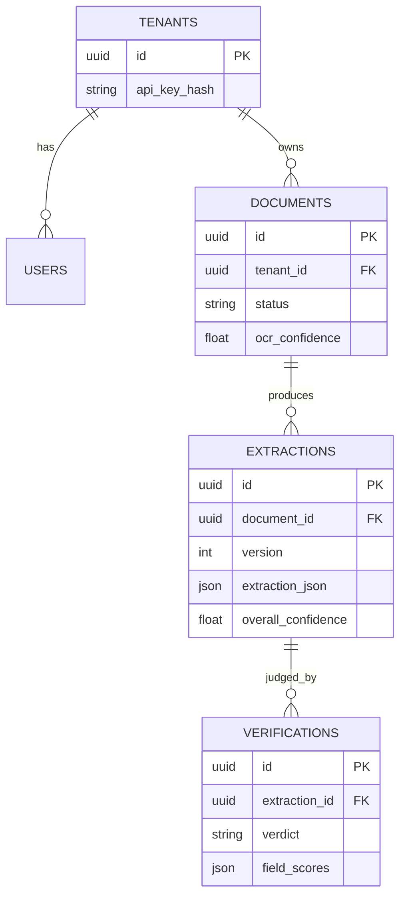

# MedDocIntel — Application Guide

**Companion to:** [../README.md](../README.md) (setup, API reference) and [HLD.md](HLD.md) (exhaustive architecture reference with sequence diagrams).
This guide is the narrative version: what the app does, how it's designed, what each file is responsible for, and where and why AI is used.

---

## 1. What This App Does

MedDocIntel turns unstructured clinical documents — scanned progress notes, PDFs, typed text — into **structured, defensible JSON**: patient identity, visit metadata, vitals, medications, diagnoses, and assessment/plan.

It is built for a specific, high-stakes constraint that generic "AI document extraction" demos ignore: **every extracted field must be defensible**. A hospital or clinic reviewing an automated extraction six months from now needs to answer "why did the system think this?" — not just "the model was 92% confident." So every field carries:

- a **value**
- a **confidence score** (0.0–1.0)
- a **source span** — the exact character offsets in the original OCR text the value was read from

The system does three things well:

1. **Reads** documents cheaply when it can, and escalates to a more expensive/capable method only when needed (OCR).
2. **Extracts** structured data against a fixed schema, never inventing values it isn't confident about.
3. **Verifies** its own output with a second, independent process — free deterministic checks first, an expensive LLM judge only when warranted — before deciding whether a human needs to look at it.

It's also **multi-tenant** (each clinic/org is isolated at the database level, not just in application code) and produces a **full audit trail** of every processing step.

### Who uses it
- **Clinics/orgs (tenants)** upload documents via the web UI or API and review flagged/rejected extractions in a review queue.
- **Machine clients** (e.g. an EHR integration, a batch importer) authenticate with an API key and hit the same endpoints programmatically.

### What it deliberately does not do (v1 non-goals)
- It does not make clinical decisions or recommendations — it extracts and verifies data, nothing else.
- It does not write back to an EHR (no FHIR/HL7 integration yet).
- It only understands one document type today (`clinical_progress_note`) — the schema is extensible, but there's no document-type classifier routing to different schemas yet.
- File storage is a local disk volume, not object storage — fine for a single node, not for horizontal scale.

---

## 2. High-Level Design

### 2.1 System context

Everything runs under Docker Compose; the only external dependency is the Anthropic API.

### 2.2 The pipeline — the heart of the system

The pipeline is **human-authored and rule-routed, not LLM-orchestrated**. A fixed sequence of stages, each with a narrow contract, means failure modes are isolable and reliability is *composable*: if a classifier is 99% reliable and extraction is 90% reliable, the combined system is provably ~89.1% reliable — you can reason about where errors come from instead of debugging an opaque agent loop.

| Stage | What it does | Cost control |
|---|---|---|
| **1 — OCR** | Tesseract locally; escalate to Claude Haiku Vision only if confidence < 0.6 | ~$0.001/page vs ~$0.01/page — 10x difference, and PHI never leaves the host unless escalated |
| **2 — Extraction** | Claude Sonnet parses OCR text into the fixed Pydantic schema | one model call per document, balanced cost/quality |
| **3 — Verification** | Free rule gates always run; Claude Opus judge only runs when confidence < 0.85 or a rule flag fired | ~80% of documents skip Opus entirely (Opus is ~10x Sonnet's cost) |

### 2.3 Data model

Two properties are deliberate:
- **Extractions are versioned** (unique per `document_id` + `version`) — you can re-run extraction without destroying history.
- **Verifications and audit logs are insert-only** — a verdict, once recorded, is never edited. That's what makes the audit trail defensible: nobody can quietly rewrite what the system decided.

### 2.4 Multi-tenancy — enforced at the database, not just the app

Every request resolves to `(tenant_id, actor)`. Before any query runs, the API executes `SET LOCAL app.current_tenant = '<id>'` on the Postgres session, and **row-level security policies** on `documents`, `extractions`, `verifications`, and `audit_logs` filter every query to that tenant automatically. If a route handler ever forgot a `WHERE tenant_id = ...` clause, the database still wouldn't leak another tenant's rows — isolation doesn't depend on every developer remembering to filter correctly.

### 2.5 Authentication

Two clean patterns, both resolved by one dependency (`get_auth`):
- **API keys** (`sk-...`) for machine clients — bcrypt-hashed, only a display prefix stored in plaintext.
- **JWTs** (HS256, 24h expiry) for human users, issued by `/auth/login`.

### 2.6 Reliability

- Celery `task_acks_late=True` — a task is only marked complete after it finishes, so a worker crash re-queues it rather than losing it.
- `worker_prefetch_multiplier=1` — a worker holds one task at a time, which is fair scheduling when tasks are slow LLM calls.
- `process_document` retries 3x (30s backoff); `verify_extraction` retries 2x (60s backoff). Exhausted retries mark the document `failed` — visible to the client, never silently stuck.
- The Opus judge failing to return valid JSON never silently accepts — it defaults to `FLAG`, routing to a human rather than guessing.

---

## 3. Code Walkthrough

### Backend (`backend/src/`)

The backend follows the pipeline order — read the files in this sequence and you're reading the system in the order a document actually flows through it.

#### [`schemas.py`](../backend/src/schemas.py) — the spec
Pydantic models that are the single source of truth for the whole system. `ExtractedField` is the core building block: every extracted value is a `{value, confidence, source_span}` triple, never a bare value. `PatientInfo`, `VisitInfo`, `VitalsInfo`, `MedicationInfo`, `DiagnosisInfo`, `AssessmentPlan` compose into `ClinicalProgressNoteExtraction`, the top-level result. Because this file is the spec, the extraction prompt, the validation, and the database's JSONB storage all derive from it — add a field once here and it flows everywhere.

#### [`ocr.py`](../backend/src/ocr.py) — Stage 1
`OCRProcessor` handles `.txt` (read directly, confidence 1.0), PDFs (`pdf2image` rasterizes each page, OCRs it, joins with page-break markers), and images. For images: run Tesseract, normalize its 0–100 confidence to 0–1, and if that's below `CONFIDENCE_THRESHOLD = 0.6` — or Tesseract isn't installed, or it throws — escalate to Claude Haiku Vision, which is given a fixed confidence of 0.92 since it doesn't expose a native per-character score.

#### [`extraction.py`](../backend/src/extraction.py) — Stage 2
`ExtractionAgent` builds a system prompt from the schema itself: a field-by-field JSON shape, confidence-banding rules (0.95+ = explicit, below 0.50 = use `null` instead of guessing), and one worked few-shot example with real source spans. It calls `claude-sonnet-4-6`, strips any accidental markdown fencing from the response, parses the JSON (an invalid response raises, which the caller lets Celery retry rather than storing bad data), and maps the raw dict into the Pydantic models field-by-field via `_build_*` helpers. `_compute_overall_confidence` is a weighted mean — patient identity, visit metadata, and medication/diagnosis core fields count; fields that were legitimately absent (confidence 0) are excluded rather than dragging the average down.

#### [`verification.py`](../backend/src/verification.py) — Stage 3
Two independent checks, run in sequence:
- `run_rule_gates` — free, deterministic: required fields present (patient name/DOB/MRN, visit date/provider/chief complaint), vital signs within physiologic ranges (`VITAL_RANGES` dict), visit date not in the future.
- `run_opus_judge` — calls `claude-opus-4-8` with the original OCR text and the extraction side-by-side, asking it to score each section 0.0–1.0 against the source. Only invoked when `verify()` decides confidence is below 0.85 or a rule gate fired.

`verify()` combines both into a `VerificationResult` and a verdict: `REJECT` on any missing required field, `ACCEPT` above 0.85 with no flags, `FLAG` above 0.70, `REJECT` otherwise.

#### [`tasks.py`](../backend/src/tasks.py) — the async pipeline
Two Celery tasks chained together. `process_document` runs OCR then extraction, persists a versioned `Extraction` row, and enqueues `verify_extraction`. `verify_extraction` runs the verification module and writes an immutable `Verification` row, flipping the document's `status` to `verified` / `flagged` / `rejected`. Both write append-only `AuditLog` rows (`PROCESSING_STARTED`, `EXTRACTION_COMPLETE`, `VERIFICATION_COMPLETE`) with no PHI in the metadata. Celery config (`acks_late`, `prefetch_multiplier=1`, per-task retry policy) lives at the top of this file.

#### [`db.py`](../backend/src/db.py) — models + row-level security
SQLAlchemy models for `Tenant`, `User`, `Document`, `Extraction`, `Verification`, `AuditLog`. The interesting part is at the bottom: `set_tenant_context` issues `SET LOCAL app.current_tenant`, and `create_rls_policies` defines the actual Postgres `CREATE POLICY` statements — `extractions` and `verifications` policies join back up to `documents.tenant_id` since those tables don't carry `tenant_id` directly. `init_db()` creates tables and applies these policies at startup.

#### [`auth.py`](../backend/src/auth.py) — authentication
`generate_api_key`/`hash_secret`/`verify_secret` for the bcrypt-backed API key and password flows. `get_auth` is the FastAPI dependency every protected route depends on: it tries `_resolve_api_key` (linear scan over active tenants, checking the bcrypt hash — a known scale limitation, see §12 of HLD.md) and falls back to `_resolve_jwt` (decode, look up the user, confirm still active). Either path returns an `AuthContext(tenant_id, actor)`.

#### [`main.py`](../backend/src/main.py) — the API surface
FastAPI routes, thin by design — they validate input, call into `auth`/`db`/`tasks`, and return. Notable details: `lifespan()` runs `init_db()` on startup; a `timing_middleware` stamps every response with `X-Process-Time-Ms`; `upload_document` validates the file extension against an allowlist, writes bytes to a tenant-partitioned path, inserts a `pending` Document, calls `process_document.delay(doc_id)`, and returns `202` — the request never waits on OCR or extraction. `get_extraction` and `_doc_to_detail` join across `Document` → `Extraction` (latest version) → `Verification` (latest) to assemble what the UI needs in one call.

### Frontend (`web/src/`)

- **[`lib/api.ts`](../web/src/lib/api.ts)** — a typed Axios client. A request interceptor attaches the JWT from `localStorage` to every call; typed interfaces (`Document`, `ExtractionSummary`, `ExtractionDetail`) mirror the backend's Pydantic response models so the UI gets type safety across the network boundary.
- **[`lib/useAuth.ts`](../web/src/lib/useAuth.ts)** — `useAuthGuard()` is a one-line client-side route guard: redirect to `/login` if there's no token.
- **`app/page.tsx`** — dashboard; **`app/upload/`** — upload form; **`app/review/`** — the flagged/rejected queue; **`app/documents/[id]/`** — the extraction viewer, where a reviewer can see per-field confidence and (via `source_span`) trace a value back to the original text; **`app/login/`** — login form; **`components/Nav.tsx`** — shared nav shown once authenticated.

### Subproject (`clinical-lora-adapters/`)
A separate, self-hosted alternative to the Claude extraction call — one open-weights 7B base model with swappable per-specialty LoRA adapters. It has its own README with a full breakdown; see §4 below for why it exists and how it fits the AI story of this project.

---

## 4. Use of AI in This App

AI isn't bolted on here — it's the mechanism behind two of the three pipeline stages, plus an optional fourth. Every use is scoped narrowly and paired with a non-AI check, which is the actual design thesis of this project: **AI proposes, deterministic logic and a second model dispose.**

### 4.1 Where models are used, and why each one

| Slot | Model | Why this model, here |
|---|---|---|
| OCR fallback | `claude-haiku-4-5` (vision) | Cheapest capable vision model; only invoked for the pages Tesseract couldn't read confidently, so volume is low and cost per call doesn't need to be optimized further |
| Extraction | `claude-sonnet-4-6` | Runs on every document — needs the best cost/quality balance available, since it's the highest-volume model call in the system |
| Verification | `claude-opus-4-8` | The strongest available model, reserved for the ~20% of extractions that are genuinely uncertain — paying a 10x premium is worth it precisely because it's sampled, not universal |
| Self-hosted extraction (optional tier) | Mistral-7B + LoRA adapters | For deployments that need PHI to stay on-prem, or want lower marginal cost at high volume — trades hosted quality for infrastructure control |

### 4.2 How structured output is obtained (no function-calling schema enforcement)
The extraction system prompt spells out the exact JSON shape it wants, field by field, including a worked example with real source spans (`FEW_SHOT_EXAMPLE` in `extraction.py`). This is a deliberate choice over relying solely on tool-use/JSON-mode enforcement: the prompt also encodes *epistemic* rules a schema alone can't express — confidence banding (0.95+ only for unambiguous text; below 0.50 means "use null, don't guess"), an explicit instruction never to hallucinate a value, and the requirement that every field justify itself with a source span. A malformed response is treated as a hard failure (raises, triggers a Celery retry) rather than something to silently patch around.

### 4.3 Confidence as a routing signal, not just a UI label
`overall_confidence` isn't cosmetic — it's the variable that decides whether the expensive Opus judge runs at all (`verification.py`: `run_opus = extraction_confidence < 0.85 or has_rule_flags`). This is the load-bearing cost-control mechanism of the whole system: confidence is computed once, cheaply, by the same call that already had to run, and it gates a second, 10x-more-expensive model call.

### 4.4 LLM-as-judge, with a designed failure mode
Verification's Opus stage is a classic LLM-as-judge pattern: same source text, different (stronger) model, scoring the first model's output rather than repeating its work. The judge's prompt asks for structured per-section scores plus an explicit `recommendation`. Critically, if the judge itself returns unparseable JSON, the system does **not** default to accepting the extraction — it defaults to `FLAG` (`run_opus_judge`'s except-branch), because the two ways this pipeline is allowed to fail are "correctly identified as uncertain" or "a human looks at it," never "silently wrong."

### 4.5 Human-authored routing, deliberately not an LLM orchestrator
The single biggest AI-related architectural decision in this repo is what it *doesn't* delegate to a model: which stage runs next, and whether to escalate. That routing is fixed, deterministic code (`if confidence < threshold: escalate`), not an agent deciding dynamically. The stated reason (see `README.md` → Architecture Decisions) is that fixed routing makes reliability composable and errors traceable to a specific stage; an LLM-as-orchestrator collapses that into "the model decided," which is much harder to debug and much easier for two models to fail in a correlated way.

### 4.6 The LoRA subproject — a second AI technique, not a duplicate
`clinical-lora-adapters/` demonstrates a materially different AI engineering skill from the main pipeline: instead of calling a hosted model well, it **fine-tunes and serves one**. Key points, since this is the part worth being able to go deep on:
- **Parameter-efficient fine-tuning (QLoRA)**: one 4-bit base model (~4.5GB) stays resident; each specialty adapter is a ~30MB delta on top, versus ~14GB for a fully fine-tuned model per specialty.
- **A single shared prompt contract** (`common/prompts.py`) used by training, evaluation, and serving — because a LoRA adapter only behaves correctly for the exact prompt format it was trained against.
- **Completion-only loss**: prompt tokens are masked (`labels=-100`) during training so the model is graded only on the output it should produce, not on reproducing the prompt.
- **Fair evaluation**: `eval.py` loads the base model once and toggles the adapter on/off with `PeftModel.disable_adapter()`, so base-vs-adapter numbers are guaranteed to come from identical weights, isolating the adapter as the only variable.
- **Synthetic training data, honestly labeled as such**: MIMIC-III requires PhysioNet credentialing, so `data/generate_data.py` uses Claude to generate self-consistent (note, gold-label) pairs instead — a deliberate, documented limitation (format learning, not validated clinical accuracy) rather than an overstated claim.

### 4.7 Cost discipline as a first-class AI engineering concern
Every AI call in this system is instrumented for cost, not just correctness: `TokenUsage.estimated_cost_usd` is computed and stored per extraction; the OCR escalation threshold and the Opus sampling threshold both exist specifically to keep the two most expensive model calls off the common path. Treating "how much does this call cost, and can we avoid it" as a design constraint alongside "is this accurate" is the throughline across every AI-touching part of the codebase.
