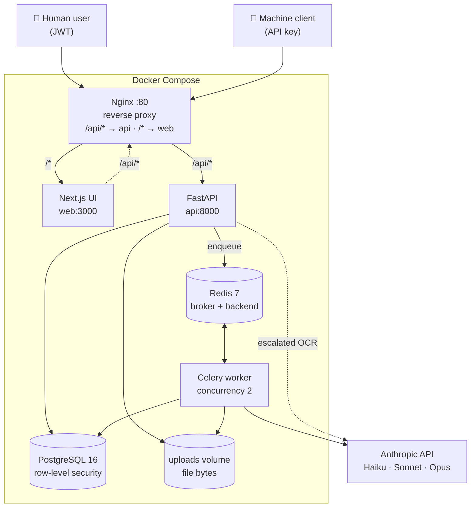
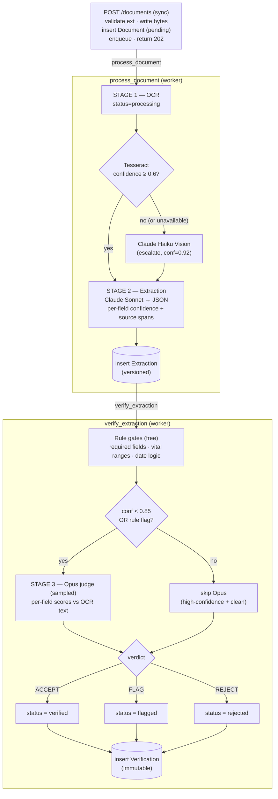
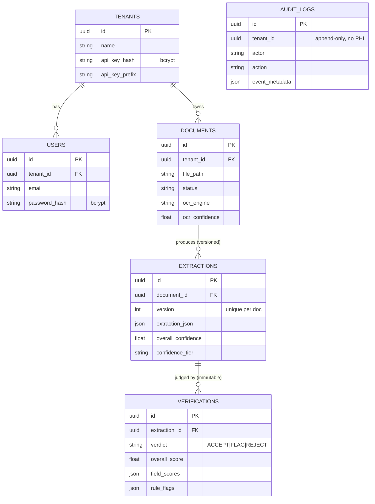

# MedDocIntel — High-Level Design (HLD)

**Status:** v1.0
**Last updated:** 2026-06-26
**Scope:** Clinical Document Intelligence as a Service — extracting structured, defensible data from medical documents (PDFs, scans, images, text) via a multi-stage AI pipeline with verification, multi-tenant isolation, and a full audit trail.

---

## 1. Purpose & Goals

MedDocIntel ingests unstructured clinical documents and produces **structured JSON** (patient, visit, vitals, medications, diagnoses, assessment/plan) where **every field carries a confidence score and a source span** (character offsets into the original OCR text).

### Primary goals

| Goal | How it's met |
|---|---|
| **Accuracy** | Two-tier OCR + spec-driven extraction + Opus-as-judge verification |
| **Defensibility** | `source_span` on every field; immutable verification + audit records |
| **Cost control** | Cheap-first escalation at both OCR and verification stages |
| **Multi-tenancy** | Postgres row-level security (RLS) keyed on `app.current_tenant` |
| **Reliability** | Human-authored routing (no LLM orchestrator); async retries; late-ack queue |

### Non-goals (v1)

- Not a clinical decision-support tool (no diagnosis/treatment recommendations).
- No EHR write-back / HL7 / FHIR integration yet.
- Single document type: `clinical_progress_note`. Schema is extensible but not multi-type routed yet.
- File storage is local disk (single-node), not object storage.

---

## 2. System Context



All services run under **Docker Compose**. The only external dependency is the **Anthropic API**.

---

## 3. Component Inventory

| Component | Tech | Responsibility |
|---|---|---|
| **Nginx** | nginx:alpine | TLS termination point, path routing, 50 MB upload limit |
| **Web** | Next.js 15 + Tailwind | Upload, dashboard, review queue, extraction viewer; typed API client |
| **API** | FastAPI + Python 3.11 | Auth, file upload, document/extraction read APIs, enqueues jobs |
| **Worker** | Celery (concurrency 2) | Async OCR → extraction → verification pipeline |
| **Broker/Backend** | Redis 7 | Celery task queue + result backend |
| **Database** | PostgreSQL 16 + SQLAlchemy + Alembic | Tenants, users, documents, extractions, verifications, audit logs; RLS |
| **Object/file store** | Docker volume (`uploads`) | Raw uploaded file bytes, partitioned by tenant |
| **LLM provider** | Anthropic | Haiku (vision OCR), Sonnet (extraction), Opus (verification judge) |

---

## 4. Core Pipeline (the heart of the system)

The pipeline is **human-authored and rule-routed**, not LLM-orchestrated. Each stage has a fixed contract, so failure modes are isolable and reliability is composable (e.g. `0.99 classifier × 0.90 extraction = 0.891`).



### Stage 1 — OCR ([backend/src/ocr.py](../backend/src/ocr.py))

- **Tesseract first** (local, ~$0.001/page, no PHI leaves the host). Confidence normalized to 0–1 from Tesseract's 0–100.
- **Escalation rule:** if Tesseract confidence `< 0.6` (or Tesseract is unavailable/errors), escalate to **Claude Haiku Vision** (~$0.01/page), assigned a fixed confidence of 0.92.
- `.txt` and pre-supplied text bypass OCR at confidence 1.0. PDFs are rasterized per page via `pdf2image`, OCR'd, and concatenated with page-break markers.

### Stage 2 — Extraction ([backend/src/extraction.py](../backend/src/extraction.py))

- **Spec-first**: the Pydantic schemas in [schemas.py](../backend/src/schemas.py) *are* the contract; the system prompt is built from them, plus one few-shot example.
- Model: **`claude-sonnet-4-6`** — balanced cost/quality for the extraction slot.
- Every field returns `{value, confidence, source_span:[start,end]}`. Source spans are character offsets into the OCR text → reviewers can trace any field back to what the model saw.
- `overall_confidence` = mean of non-zero field confidences, weighted toward patient identity + visit metadata + medication/diagnosis core fields.
- Token usage captured for cost tracking.

### Stage 3 — Verification ([backend/src/verification.py](../backend/src/verification.py))

Two sub-stages:

1. **Rule gates (deterministic, free):** required-field presence (patient name/dob/mrn, visit date/provider/chief complaint), vital-sign physiologic range checks, visit-date-not-in-future.
2. **Opus judge (`claude-opus-4-8`, sampled):** runs **only** when `extraction_confidence < 0.85` **or** a rule gate fired. Scores each section against the source OCR text. High-confidence, clean extractions skip Opus entirely (~80% verification-cost reduction).

**Verdict logic:**

| Condition | Verdict | Document status |
|---|---|---|
| Missing required field | `REJECT` | `rejected` |
| `overall_score > 0.85` and no rule flags | `ACCEPT` | `verified` |
| `overall_score > 0.70` | `FLAG` | `flagged` |
| otherwise | `REJECT` | `rejected` |

---

## 5. Data Model ([backend/src/db.py](../backend/src/db.py))



> `audit_logs` is tenant-scoped and append-only; it is not foreign-keyed to the other tables so audit history survives row deletion.

| Table | Key columns | Notes |
|---|---|---|
| `tenants` | `api_key_hash` (bcrypt), `api_key_prefix` | One API key per org; only hash + prefix stored |
| `users` | `tenant_id`, `email`, `password_hash` (bcrypt) | Human users; JWT auth |
| `documents` | `tenant_id`, `file_path`, `status`, `ocr_*` | Bytes on disk, metadata in DB. Status: pending→processing→extracted→verified/flagged/rejected/failed |
| `extractions` | `document_id`, `version`, `extraction_json` (JSONB), `overall_confidence`, `confidence_tier`, tokens | **Versioned** — unique on `(document_id, version)`; supports re-extraction |
| `verifications` | `extraction_id`, `verdict`, `overall_score`, `field_scores`, `rule_flags` | **Immutable** — insert-only audit record |
| `audit_logs` | `tenant_id`, `actor`, `action`, `resource_*`, `event_metadata` | **Append-only**; system writes PROCESSING_STARTED / EXTRACTION_COMPLETE / VERIFICATION_COMPLETE |

**Versioning & immutability** are deliberate: extractions can be re-run (new version), but verification verdicts and audit entries are never mutated — required to defend a decision years later (HIPAA, 21 CFR Part 11).

---

## 6. Multi-Tenancy & Security

### Tenant isolation — Postgres Row-Level Security
- Every request resolves to a `(tenant_id, actor)` pair (`AuthContext`).
- `set_tenant_context(db, tenant_id)` runs `SET LOCAL app.current_tenant = '<id>'` per request.
- RLS policies on `documents`, `extractions`, `verifications`, `audit_logs` automatically filter all queries to the current tenant. Isolation is enforced at the **database layer**, not just application code.
- File storage is also tenant-partitioned: `uploads/<tenant_id>/<doc_id>.<ext>`.

### Authentication ([backend/src/auth.py](../backend/src/auth.py))
- **API keys** (machine-to-machine): generated `sk-...`, bcrypt-hashed, prefix kept for display. Bearer token.
- **JWTs** (human users): `POST /auth/login` → HS256 JWT, 24 h expiry, carries `tenant_id`/`email`.
- `get_auth` dependency tries API key, then JWT; raises 401 otherwise.

### Security considerations / current gaps
- **PHI handling:** Tesseract keeps PHI local; only escalated pages and extraction prompts reach Anthropic. Audit metadata is deliberately PHI-free.
- **Known v1 hardening gaps** (see §9): CORS is `*`; API-key lookup is a linear scan over active tenants (`verify_secret` per tenant); JWT/API-key secrets via env; no rate limiting; users' `email` is globally unique rather than per-tenant; Nginx is HTTP-only (TLS expected to terminate upstream in prod).

---

## 7. API Surface ([backend/src/main.py](../backend/src/main.py))

| Method | Endpoint | Auth | Description |
|---|---|---|---|
| GET | `/health` | — | Liveness probe |
| POST | `/auth/signup/tenant` | — | Create tenant, returns API key once |
| POST | `/auth/signup/user` | API key | Add user under tenant |
| POST | `/auth/login` | — | Email/password → JWT |
| POST | `/documents` | JWT/API key | Upload (async); returns 202 + doc_id |
| GET | `/documents` | JWT/API key | List (optional `status_filter`, `limit`) |
| GET | `/documents/{id}` | JWT/API key | Document detail + extraction summaries |
| GET | `/documents/{id}/extraction` | JWT/API key | Latest extraction + verification |
| GET | `/review-queue` | JWT/API key | Documents in `flagged`/`rejected` |

Upload is **async**: the API persists the file + a `pending` Document, enqueues `process_document`, and returns `202`. Clients poll `GET /documents` until status reaches a terminal state.

```mermaid
sequenceDiagram
    actor Client
    participant API as FastAPI
    participant DB as PostgreSQL
    participant Q as Redis/Celery
    participant W as Worker
    participant LLM as Anthropic

    Client->>API: POST /documents (file + Bearer)
    API->>API: validate ext · write bytes to disk
    API->>DB: insert Document (pending)
    API->>Q: enqueue process_document(doc_id)
    API-->>Client: 202 Accepted {document_id, pending}

    Q->>W: process_document(doc_id)
    W->>DB: status = processing
    W->>LLM: OCR (Tesseract local; Vision if conf<0.6)
    W->>LLM: extract (Sonnet)
    W->>DB: insert Extraction (extracted)
    W->>Q: enqueue verify_extraction(extraction_id)

    Q->>W: verify_extraction(extraction_id)
    W->>W: rule gates
    opt conf<0.85 OR rule flag
        W->>LLM: Opus judge
    end
    W->>DB: insert Verification · status = verified/flagged/rejected

    loop poll until terminal status
        Client->>API: GET /documents
        API->>DB: SET LOCAL app.current_tenant + query
        API-->>Client: documents + statuses
    end
```

---

## 8. Key Design Decisions (and rationale)

| Decision | Rationale |
|---|---|
| **Tesseract → Claude Vision fallback** | Cheap & PHI-local first; escalate only hard pages. 10× cost difference. |
| **Source span on every field** | Regulatory defensibility — reviewers can trace each field to source chars. |
| **Human-authored routing, not LLM orchestrator** | Isolable failure modes; composable reliability math; two LLMs can't fail together. |
| **Sampled Opus verification** | Opus ~10× Sonnet cost; skip it for high-confidence, rule-clean extractions (~80% saving). |
| **Spec-first (Pydantic = contract)** | One source of truth drives prompts, validation, serialization. |
| **Versioned extractions / immutable verifications** | Re-extraction without losing history; audit-grade verdict trail. |
| **Postgres RLS for tenancy** | Defense in depth — isolation survives application-layer bugs. |
| **Rolled auth (PyJWT + bcrypt)** | Zero external dependency; two clean patterns (API key vs JWT). |
| **Celery `acks_late` + prefetch 1** | Re-queue on worker crash; fair scheduling for long LLM calls. |

---

## 9. Reliability, Failure Modes & Cost

### Failure handling
- `process_document`: up to **3 retries** (30 s delay); on terminal failure sets `status=failed`.
- `verify_extraction`: up to **2 retries** (60 s delay).
- `task_acks_late=True`: a task is re-queued if a worker dies mid-flight.
- Opus judge JSON parse failure → safe default verdict `FLAG` (never silently accept).
- Invalid extraction JSON from Sonnet → raises, triggering retry.

### Cost model (rough)
| Stage | Unit cost |
|---|---|
| Tesseract OCR | ~$0.001 / page |
| Claude Vision OCR (escalated) | ~$0.01 / page |
| Sonnet extraction | $3/M in, $15/M out (tracked per extraction) |
| Opus verification | sampled only; ~80% of extractions skip it |

### Scaling notes
- Stateless API + worker scale horizontally; Redis + Postgres are the shared state.
- Worker concurrency tunable (`--concurrency`, currently 2); prefetch 1 keeps LLM work fair.
- **Single-node bottlenecks to address for scale-out:** local `uploads` volume (move to S3/object storage), linear API-key scan (index/lookup by prefix), DB connection pooling under high worker count.

---

## 10. Frontend (Next.js)

- `web/src/app/` — `page.tsx` (dashboard), `upload/`, `review/`, `login/`, `documents/[id]/` (extraction viewer).
- `web/src/lib/api.ts` — typed API client; `useAuth.ts` — token/session handling; `components/Nav.tsx`.
- Talks to the API through Nginx (`/api/*`). Extraction viewer surfaces per-field confidence and source spans for human review of flagged/rejected docs.

---

## 11. Deployment & Environments

- **Local/dev:** `docker compose up --build` brings up postgres, redis, api, worker, web, nginx. UI at `http://localhost`, API docs at `:8000/docs`.
- **Config via `.env`:** `ANTHROPIC_API_KEY`, `POSTGRES_PASSWORD`, `JWT_SECRET` (+ derived `DATABASE_URL`, `REDIS_URL`, `UPLOAD_DIR`).
- **Schema:** `init_db()` creates tables + RLS policies at startup; Alembic present for migrations.
- **Tests:** `pytest` with mocked Anthropic clients (no API calls/cost).

---

## 12. Future Work

- Object storage for uploads (S3) + signed URLs.
- Multi-document-type classification + routing (the "classifier" in the reliability model).
- EHR integration (FHIR/HL7 export).
- Production hardening: scoped CORS, rate limiting, per-tenant unique email, API-key prefix index, TLS at Nginx, secret manager.
- Reviewer correction loop → feeds new extraction versions; human-in-the-loop metrics.
- Observability: structured metrics on verdict distribution, escalation rate, cost per document.
